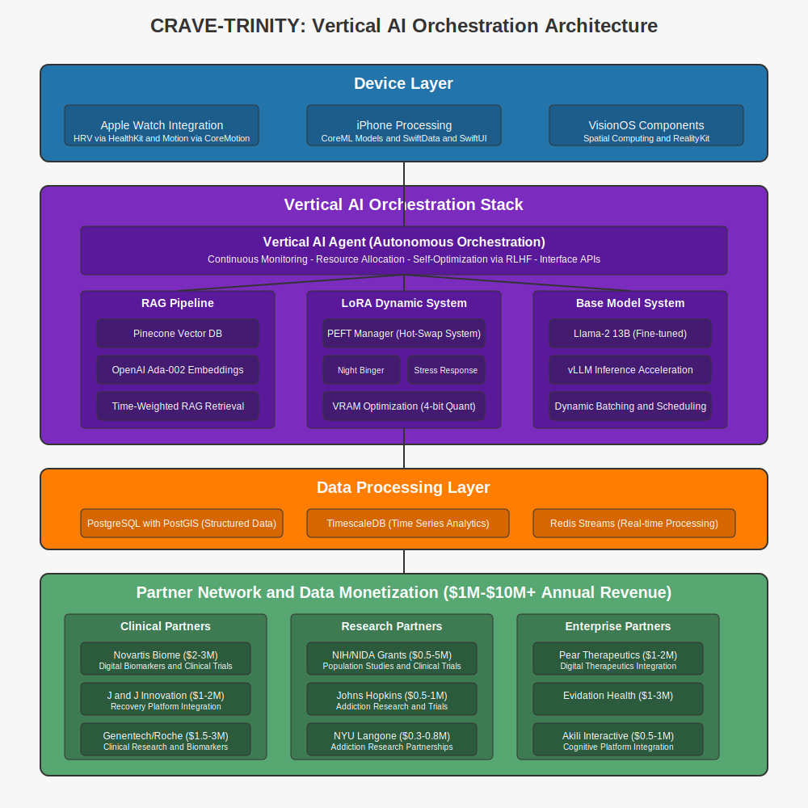
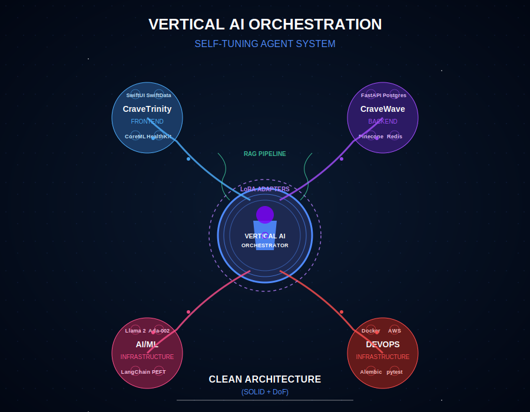

# 🌊 CRAVE WAVE (Trinity Backend): Vertical AI Optimization for Craving Intelligence

## 🌟 Overview  
CRAVE WAVE (Trinity Backend) is a modular, Dockerized FastAPI application built with clean architecture principles. It is designed to track and analyze user cravings and integrates multiple external services, including:  

- 🛢 **PostgreSQL** for structured data storage  
- 🧠 **Pinecone** for vector-based retrieval 
- 🤖 **Llama 2 with LoRA integration** for AI-powered insights

This repository demonstrates an end-to-end system—from initial setup and database migrations to AI model inference with LoRA adapters.  
* 🔗 Frontend (SwiftUI + SwiftData + MVVM) → [crave-trinity-frontend](https://github.com/Crave-Trinity/crave-trinity-frontend)
* 🔗 Backend (FastAPI + PostgreSQL + Pinecone + Llama 2) → [crave-trinity-backend](https://github.com/Crave-Trinity/crave-trinity-backend)

---

⚠️ Disclaimer: CRAVE intends to provide analytical insights based on user-logged cravings data.

It will not offer medical predictions, diagnoses, or treatment prior to FDA SaMD approval.
Any behavioral insights should be viewed as informational only, and users should consult a healthcare professional for medical or therapeutic guidance.

---



## 🌊 Vision
CRAVE-WAVE
The world's first self-optimizing craving intelligence system—a backend powered by Vertical AI, ensuring that craving personas, retrieval strategies, and inference evolve dynamically as moat and user behavior shift.

## 🚀 CRAVE WAVE - Finalized Tech Stack  

### **1️⃣ Core Tech Stack**
| **Component**            | **Technology**                                      | **Rationale**  |
|-------------------------|--------------------------------------------------|---------------|
| **LLM Model**           | **Llama 2 (13B) on AWS**                         | Best open-source model that supports LoRA fine-tuning. Not restricted like GPT-4. |
| **Vector Database**      | **Pinecone**                                     | Production-grade, built for high-performance retrieval at scale. |
| **Embeddings**          | **OpenAI `text-embedding-ada-002`**               | Best semantic search embeddings for RAG. |
| **Fine-Tuning Framework** | **LoRA (Low-Rank Adaptation) via PyTorch + Hugging Face `peft`** | Allows persona-level fine-tuning without massive compute costs. |
| **RAG Pipeline**        | **LangChain**                                    | Provides high-level abstractions for orchestrating retrieval, prompt assembly, and response generation. |
| **Backend & Deployment** | **Python (FastAPI) on AWS EC2/ECS**              | Python for ML, FastAPI for async speed, AWS for scalability. |
| **Structured Database**  | **PostgreSQL (AWS RDS)**                        | Stores craving logs, user metadata, and structured behavioral data for analytics & AI modeling. |

---

🧠 **Intelligent Persona System**

* AI-powered LoRA hot-swapping ensures only relevant craving personas are active, with dynamic offloading of unused personas and continuous optimization based on real-world triggers
* Reinforcement Learning (RLHF) framework automatically refines persona deployment and selection strategies
* Custom attention mechanisms and adapter weights evolve based on user interaction patterns

🔍 **Advanced Retrieval & Memory**

* Time-compressed RAG pipeline that prioritizes recent cravings while intelligently summarizing long-term patterns
* Dynamic retrieval scaling adjusts vector DB query depth and response relevance based on historical interactions
* Intelligent caching system creates compressed trend markers for cost-efficient, rapid retrieval
* Hybrid dense/sparse vector indexing for optimal context matching

⚡ **Self-Optimizing Infrastructure**

* Real-time VRAM/CPU monitoring with automated resource allocation and scaling
* Quantization and adaptive batching ensure LLaMA/LoRA models maintain peak efficiency
* Distributed inference system automatically manages active nodes to prevent bottlenecks
* Production-grade monitoring stack tracks system health and performance metrics

---

<div align="center">
  
</div>

---

## 🚀 How It Works – End-to-End
### 1️⃣ Craving Data Ingestion
- Apple Watch + iPhone send craving logs (timestamp, HRV, location, user mood, notes).  
- Stored in two places:
  - PostgreSQL (structured metadata like timestamps).  
  - Pinecone (embedded craving logs for retrieval).  

---

### 2️⃣ RAG Personalization – How AI Feels Personal Without Full Fine-Tuning 
🔹 **Process:**  
1. User Query: (“Why do I crave sugar at night?”)  
2. Backend Embeds Query: Uses `text-embedding-ada-002`.  
3. Retrieves Relevant Logs: Pinecone finds most relevant past craving logs.  
4. Compiles Personalized Context: LangChain assembles user history + question into a structured prompt.  
5. LLM Generates a Response: Feeds the retrieved logs + user’s question to Llama 2.  

✅ Ensures that AI responses feel personalized, without training a separate model per user.  

---

### 3️⃣ LoRA Fine-Tuning – Craving Archetypes for Deeper Personalization
🔹 **Why We Need This:**  
- RAG personalizes via past data, but doesn’t change how the AI "thinks." 
- LoRA lets us create craving-specific personas for better contextualization. 

🔹 **How It Works:**  
1. Users are categorized into craving personas (e.g., “Nighttime Binger,” “Stress Craver,” “Alcohol Dopamine-Seeker”).  
2. Each persona has a lightweight LoRA adapter fine-tuned on past craving data.  
3. During inference, we dynamically load the relevant LoRA adapter onto Llama 2.  
4. Final Response = RAG Retrieved Context + LoRA Fine-Tuned Persona + User Query.
*  ✅  This provides "adaptive" AI insights without massive per-user fine-tuning costs.

---

### 🚀 How we make real-time LoRA swapping work efficiently:
✅ Step 1: Load the Base Model into GPU Memory
- Load LLaMA 2 (13B) onto an AWS A100 GPU instance (or H100 if needed).

✅ Step 2: Preload the 2-3 Most Common LoRA Adapters in VRAM
- Track most-used craving personas and keep them loaded in GPU memory.
- Store remaining adapters in CPU RAM for fast retrieval.
  
✅ Step 3: Implement a Fast Cache System for LoRA Adapters
- Store adapters in Redis (or in-memory storage) for quick access.
- If not in VRAM, fetch from CPU RAM before disk.

✅ Step 4: Optimize LoRA Swapping for Concurrency
- Batch requests when multiple users need the same adapter.
- Queue unique adapter loads instead of swapping instantly.
  
✅ Step 5: Monitor GPU Usage & Tune for Performance
Implement profiling to see if we need more VRAM per instance.
If GPU becomes a bottleneck, scale horizontally by adding more instances.

---

### 4️⃣ Data Retention & Time-Based Prioritization
🔹 Problem: As users log cravings for months or years, RAG retrieval becomes bloated.  
🔹 Solution: Implement time-weighted retrieval:  
* ✅ Last 30 Days = High Priority Logs  
* ✅ Older Logs = Summarized & Compressed
* ✅ Historical Insights = Only Retrieved When Highly Relevant 

🔹 **How It Works:**  
- Recent cravings are fully stored & retrieved. 
- Older cravings get "trend compressed" (e.g., "In the last 6 months, sugar cravings spiked in winter").  
- Retrieval automatically prioritizes recent, high-relevance logs. 
- Prevents AI responses from becoming inefficient over time. 

---

## 🚀 Step-by-Step Execution Plan
### ✅ Step 1: Build the Data Pipeline
- Set up FastAPI endpoints for craving logs.  
- Integrate Pinecone to store craving text data.  
- Set up PostgreSQL (or DynamoDB) for structured craving metadata.  

### ✅ Step 2: Implement RAG for Personalized Craving Responses
- Install LangChain + Pinecone for retrieval.  
- Create a retrieval chain that injects user craving logs into AI prompts.  
- Connect the retrieval chain to Llama 2 for personalized AI responses.  

### ✅ Step 3: Build LoRA Fine-Tuned Craving Personas
- Fine-tune Llama 2 LoRA adapters for different craving archetypes using Hugging Face `peft`.  
- Store LoRA adapters separately and **dynamically load them** per user persona.  

### ✅ Step 4: Deploy on AWS & Optimize for Real-Time Inference
- Launch Llama 2 (13B) on an AWS GPU instance (g5.xlarge or A100-based).  
- Set up API endpoints for craving insights.  
- Implement RAG caching & batching for efficiency.  

---

## 🚀 Why This Stack Wins
* ✅ RAG ensures personalization without training individual models.
* ✅ LoRA makes craving personas possible at low cost.
* ✅ AWS GPU hosting means real-time inference at scale.
* ✅ Python + FastAPI = Fast iteration speed & flexibility.
* ✅ The architecture is built to scale, adapt, and improve.

---

## 🚀 Next Steps  
* 💥 1️⃣ Find a visionary technical co-founder
* 💥 2️⃣ Start implementing this backend architecture  
* 💥 3️⃣ Ship, Talk to Users, Iterate
 
---

## 🏗 Architecture & Batches  

The project was developed with AI-acceleration & basecode abstraction through modular batches, breaking the development process into structured steps:  

### 🔹 Batch 1 – Initial Setup  
📌 Clone the repository, install dependencies, and configure the environment.  
🔧 Initialize PostgreSQL and apply Alembic database migrations.  
📂 Key files: `.env`, `requirements.txt`, `alembic.ini`  

### 🔹 Batch 2 – Backend & Database Integration  
🛠 Develop FastAPI REST endpoints following clean architecture.  
📊 Implement database models, repositories, and use-case layers for craving tracking.  
📂 Key files: `app/api/`, `app/core/`, `app/infrastructure/database/`  

### 🔹 Batch 3 – External Services Integration  
📡 Connect to Pinecone for vector storage & retrieval.  
🤖 Integrate OpenAI embeddings for craving analysis.  
📂 Key files: `app/infrastructure/vector_db/`, `app/infrastructure/external/openai_embedding.py`  

### 🔹 Batch 4 – Llama 2 with LoRA Integration  
🦙 Load and fine-tune Llama 2 using LoRA adapters.  
🔍 Deploy AI inference endpoints for craving insights.  
📂 Key files: `app/models/llama2_model.py`, `app/infrastructure/llm/llama2_adapter.py`  

---

## 📂 File Structure  

```plaintext
jj@DESKTOP-L9V85UA:/mnt/c/Users/JJ/Desktop/CRAVE/crave_trinity_backend$ tree -I ".git"
.
################################################################################
#                                                                              
#  "I understand there's a guy inside me who wants to lay in bed,              
#   smoke weed 🍃 all day, and watch cartoons and old movies.                     
#   My whole life is a series of stratagems to avoid, and outwit, that guy."  
#                                                                              
#   - Anthony Bourdain                                                                                                                         
#                                                                              
################################################################################
#
#
#
├── Dockerfile
├── README.md
├── alembic.ini
├── app
│   ├── api
│   │   ├── dependencies.py
│   │   ├── endpoints
│   │   │   ├── ai_endpoints.py
│   │   │   ├── craving_logs.py
│   │   │   ├── dependencies.py
│   │   │   ├── health.py
│   │   │   └── user_queries.py
│   │   └── main.py
│   ├── config
│   │   ├── __pycache__
│   │   │   └── settings.cpython-310.pyc
│   │   ├── logging.py
│   │   └── settings.py
│   ├── container
│   │   ├── Dockerfile
│   │   └── ecs_config.yaml
│   ├── core
│   │   ├── entities
│   │   │   ├── craving.py
│   │   │   └── user.py
│   │   ├── services
│   │   │   ├── analytics_service.py
│   │   │   ├── embedding_service.py
│   │   │   ├── lora_manager.py
│   │   │   ├── pattern_detection_service.py
│   │   │   └── rag_service.py
│   │   └── use_cases
│   │       ├── generate_craving_insights.py
│   │       ├── ingest_craving.py
│   │       ├── manage_metadata.py
│   │       ├── process_query.py
│   │       └── search_cravings.py
│   ├── infrastructure
│   │   ├── auth
│   │   │   ├── auth_service.py
│   │   │   ├── oauth_provider.py
│   │   │   └── user_manager.py
│   │   ├── database
│   │   │   ├── __pycache__
│   │   │   │   └── models.cpython-310.pyc
│   │   │   ├── migrations
│   │   │   │   ├── README
│   │   │   │   ├── __pycache__
│   │   │   │   │   └── env.cpython-310.pyc
│   │   │   │   ├── env.py
│   │   │   │   ├── script.py.mako
│   │   │   │   └── versions
│   │   │   │       ├── 200c7d532370_initial_tables_users_cravings.py
│   │   │   │       └── __pycache__
│   │   │   │           └── 200c7d532370_initial_tables_users_cravings.cpython-310.pyc
│   │   │   ├── models.py
│   │   │   └── repository.py
│   │   ├── external
│   │   │   ├── langchain_integration.py
│   │   │   └── openai_embedding.py
│   │   ├── llm
│   │   │   ├── huggingface_integration.py
│   │   │   ├── llama2_adapter.py
│   │   │   └── lora_adapter.py
│   │   └── vector_db
│   │       ├── pinecone_client.py
│   │       └── vector_repository.py
│   └── models
│       └── llama2_model.py
├── docker-compose.yml
├── docs
│   ├── architecture.md
│   └── roadmap.md
├── infra
│   ├── aws
│   ├── docker
│   └── k8s
├── main.py
├── pyproject.toml
├── requirements.txt
└── tests
    ├── integration
    │   ├── test_ai_endpoints.py
    │   ├── test_api.py
    │   └── test_craving_search_api.py
    ├── test_basic.py
    └── unit
        ├── test_auth_service.py
        ├── test_ingest_craving.py
        ├── test_lora_adapter.py
        ├── test_rag_service.py
        └── test_search_cravings.py

30 directories, 62 files
```
---

### **⚡ Quick Start**
#### ✅ **Prerequisites**  
Before you begin, ensure you have the following installed:

- 🐳 **Docker & Docker Compose** for containerized setup  
- 🐍 **Python 3.11** (if running locally)  
- 🤗 **Hugging Face CLI** (for private models & LoRA fine-tuning)  

#### 📥 **Clone the Repository**
```bash
git clone https://github.com/Crave-Trinity/crave-trinity-backend.git
cd crave-trinity-backend
```

#### 🔧 **Configure Environment Variables**  
Create a `.env` file in the project root with the necessary credentials:

```ini
SQLALCHEMY_DATABASE_URI=postgresql://postgres:password@db:5432/crave_db
PINECONE_API_KEY=your_pinecone_api_key_here
PINECONE_ENV=us-east-1-aws
PINECONE_INDEX_NAME=crave-embeddings
OPENAI_API_KEY=your_openai_api_key_here
```
---

### 🤗 **Set Up Hugging Face Authentication (Required for LoRA & Llama 2)**
1️⃣ **Log in to Hugging Face inside the container:**
```bash
docker exec -it crave_trinity_backend-fast-api-1 bash
huggingface-cli login
```
When prompted, **paste your Hugging Face access token** (get it from https://huggingface.co/settings/tokens).

2️⃣ **Enable Git credential storage (to avoid re-authenticating):**
```bash
git config --global credential.helper store
```

3️⃣ **Verify authentication:**
```bash
huggingface-cli whoami
```
✅ **If you see your username and "Token valid (permission: write)," you're good to go!** 🚀

---

### 🏗 **Build & Run with Docker Compose**
```bash
docker-compose up --build
```
This will:  
✅ Build the FastAPI backend container  
✅ Start the PostgreSQL database  
✅ Expose ports 8000 (API) & 5432 (Database)  

---

### 🔄 **Run Database Migrations**
Inside the container (or locally, if configured):  
```bash
alembic upgrade head
```
This ensures the database schema is up to date.

---

### 🧪 **Testing the Application**
#### 🔬 **API Endpoints**
Once running, test the craving logging API:
```bash
curl -X POST -H "Content-Type: application/json" \
-d '{"user_id":1, "description":"Chocolate craving", "intensity":8}' \
http://localhost:8000/cravings
```

#### 📡 **Pinecone Integration**
Inside the FastAPI container, verify the Pinecone index:
```bash
docker exec -it crave_trinity_backend-fast-api-1 python -c \
"from app.infrastructure.vector_db.pinecone_client import init_pinecone; \
init_pinecone(); import pinecone; print('List of indexes:', pinecone.list_indexes())"
```
✅ Ensure `crave-embeddings` exists and is ready for use.

---

### 🤖 **Run Llama 2 with LoRA Inference (Batch 4)**
```bash
docker exec -it crave_trinity_backend-fast-api-1 python app/models/llama2_model.py
```
✅ This loads **Llama 2 + LoRA adapters** and runs a test inference prompt.

---

## 🛠 Technical Details  

- 🐳 Dockerized Setup  
  - The backend is containerized with Python 3.11-slim for efficiency.  

- 🛢 Database
  - Uses PostgreSQL, managed via Alembic migrations.  

- 📡 External Services 
  - Pinecone for vector storage & retrieval.  
  - OpenAI for text embeddings and craving analysis.  

- 🤖 AI Model (Batch 4) 
  - Llama 2 runs via Hugging Face Transformers.  
  - LoRA adapters fine-tune AI insights with PEFT.  

---

## 🛣 Roadmap & Future Enhancements  

🔜 Batch 5 – Analytics dashboard & craving trend visualization  
📊 Batch 6 – Performance optimizations (GPU inference, rate limiting)  
🔒 Security Enhancements – OAuth, data anonymization, and logging improvements  
🚀 Scaling – Kubernetes deployment (`infra/k8s`)  

---

🌍 Why This Changes Everything

* 💥 Static AI is dead.
* 💥 Self-learning, self-optimizing AI is the future.
* 💥 CRAVE-WAVE is that future.

💡 We don’t ask if something is possible. We build until it is.

* ⚡ AI that doesn’t just process cravings—it evolves in real time.
* ⚡ Welcome to the first self-optimizing craving intelligence system.
* ⚡ Welcome to CRAVE-WAVE.

🔥 Get Involved & Contribute
This is a revolution in craving intelligence.

📜 GitHub: Crave-Trinity Backend
📢 Twitter: Coming Soon.
🎙 YC Demo Day: Stay tuned.

---

* 🔗 Frontend (SwiftUI + SwiftData + MVVM) → [crave-trinity-frontend](https://github.com/Crave-Trinity/crave-trinity-frontend)
* 🔗 Backend (FastAPI + PostgreSQL + Pinecone + Llama 2) → [crave-trinity-backend](https://github.com/Crave-Trinity/crave-trinity-backend)

---

⚠️ Disclaimer: CRAVE intends to provide analytical insights based on user-logged cravings data.

It will not offer medical predictions, diagnoses, or treatment prior to FDA SaMD approval.
Any behavioral insights should be viewed as informational only, and users should consult a healthcare professional for medical or therapeutic guidance.

---

## 🤝 Contributing  

1️⃣ **Fork** the repository  
2️⃣ **Create** a feature branch (`git checkout -b feature/your-feature`)  
3️⃣ **Commit** your changes (`git commit -m "Added feature X"`)  
4️⃣ **Push** & open a pull request  

---

## 📜 License  

This project is licensed under the **MIT License**.  
> CRAVE: Because understanding your cravings shouldn't be complicated 🍫
